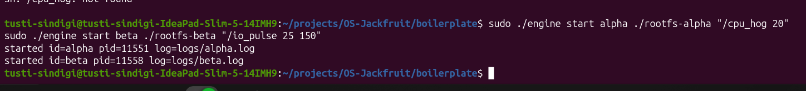
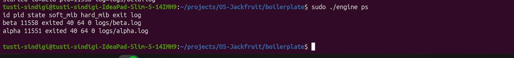
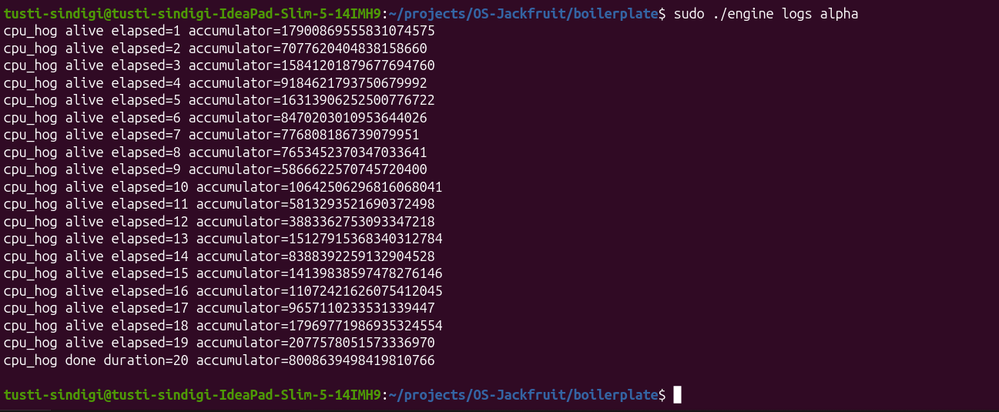
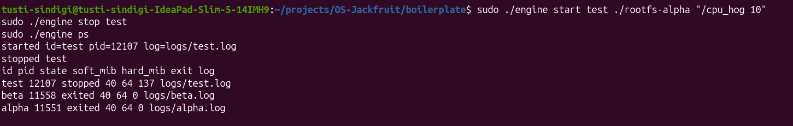
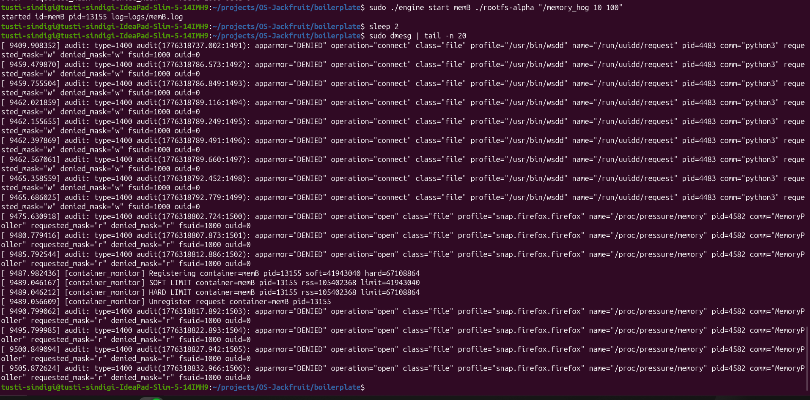
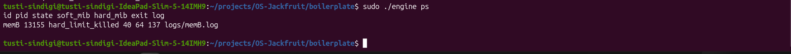
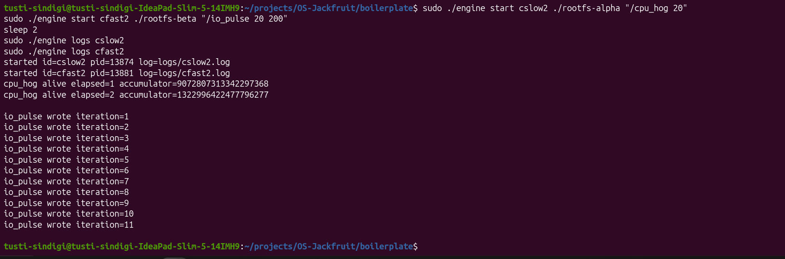
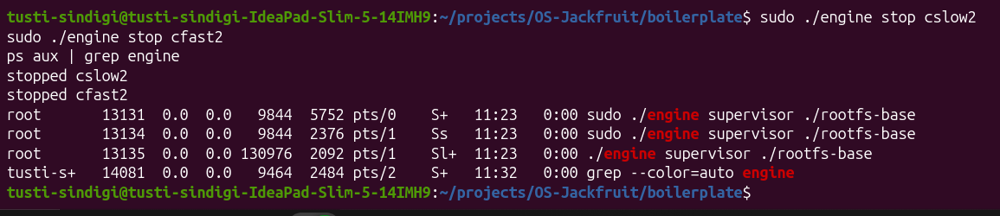

# Multi-Container Runtime

## 1. Team Information

**Name 1:** Tusti Sindigi  
**SRN 1:** PES1UG24CS505  
**Name 2:** Ritu Ravish  
**SRN 2:** PES1UG24CS928  

---

## 2. Build, Run and Cleanup Instructions

### Step 1: Build the Project
Navigate to the `boilerplate` directory and compile:
```bash
cd boilerplate
make clean && make
```

### Step 2: Load the Kernel Module
Load the kernel memory monitor module:
```bash
sudo insmod monitor.ko
```
Verify that the control device is created:
```bash
ls -l /dev/container_monitor
```

### Step 3: Start the Supervisor
Start the long-running supervisor process:
```bash
sudo ./engine supervisor ./rootfs-base
```
Keep this terminal running. Open a new terminal for further commands.

### Step 4: Prepare Container Root Filesystems
Create separate writable root filesystems for each container:
```bash
cp -a ./rootfs-base ./rootfs-alpha
cp -a ./rootfs-base ./rootfs-beta
```
Copy workload programs into the container filesystems:
```bash
cp cpu_hog rootfs-alpha/
cp io_pulse rootfs-beta/
cp memory_hog rootfs-alpha/
```

### Step 5: Start Containers
Launch multiple containers using the CLI:
```bash
sudo ./engine start alpha ./rootfs-alpha "/cpu_hog 20"
sudo ./engine start beta ./rootfs-beta "/io_pulse 25 150"
```

### Step 6: View Running Containers
Check container metadata:
```bash
sudo ./engine ps
```

### Step 7: View Logs
Inspect container output:
```bash
sudo ./engine logs alpha
```

### Step 8: Stop Containers
Terminate running containers:
```bash
sudo ./engine stop alpha
sudo ./engine stop beta
```

### Step 9: Check Kernel Logs
View memory monitor events:
```bash
sudo dmesg | tail
```

### Step 10: Unload Module and Cleanup
Unload the kernel module and clean build files:
```bash
sudo rmmod monitor
make clean
```

---

## 3. Demo with Screenshots

### SS1: Multi-container supervision
  
*Two containers (`alpha` and `beta`) running concurrently under a single supervisor process, demonstrating multi-container management.*

### SS2: Metadata tracking
  
*Output of `engine ps` showing container metadata including container ID, host PID, state (running/exited), memory limits, and log file paths.*

### SS3: Bounded-buffer logging
  
*Container output is captured via pipes and processed through a bounded-buffer logging system. Continuous `cpu_hog` output demonstrates correct producer-consumer behavior.*

### SS4: CLI and IPC
  
*A CLI command (`engine stop test`) is issued and the supervisor responds accordingly, demonstrating control-path IPC and correct state updates.*

### SS5: Soft-limit warning
  
*Kernel log (`dmesg`) showing a soft memory limit warning generated when the container exceeds its configured soft limit.*

### SS6: Hard-limit enforcement
  
*Kernel log showing process termination after exceeding the hard limit, along with `engine ps` reflecting the container state as `hard_limit_killed`.*

### SS7: Scheduling experiment
  
*Comparison between CPU-bound (`cpu_hog`) and IO-bound (`io_pulse`) workloads showing different execution behavior under the Linux scheduler.*

### SS8: Clean teardown
  
*All containers are stopped and system process list confirms no zombie processes remain, demonstrating proper cleanup and resource management.*

---

## 5. Design Decisions and Tradeoffs

### Namespace Isolation
Used `chroot` for filesystem isolation.

- **Tradeoff:** Easier to implement but less secure than `pivot_root`.

### Supervisor Design
Used a single long-running supervisor process.

- **Tradeoff:** Centralized control simplifies management but introduces a single point of failure.

### IPC Design
Used:
- Pipes for logging
- UNIX domain sockets for CLI communication

- **Tradeoff:** Slightly increased complexity but clean separation of responsibilities.

### Kernel Monitoring
Implemented memory monitoring in kernel space using an LKM.

- **Tradeoff:** Requires root privileges but ensures strict and reliable enforcement.

### Workload Design
Used simple workloads (`cpu_hog`, `io_pulse`, `memory_hog`).

- **Tradeoff:** Not highly realistic but clearly demonstrate system behavior.

---

## 6. Scheduler Experiment Results

Two workloads were executed concurrently:

| Container | Workload   | Behavior |
|----------|-----------|---------|
| cslow    | CPU-bound | Continuous computation |
| cfast    | IO-bound  | Periodic output |

### Observations

- The CPU-bound process (`cpu_hog`) continuously utilized CPU resources.
- The IO-bound process (`io_pulse`) produced periodic output and yielded CPU time.

### Analysis

The Linux scheduler ensures fairness by allowing IO-bound processes to remain responsive while CPU-bound processes utilize available CPU cycles.

This demonstrates how the scheduler balances:
- CPU utilization
- Responsiveness
- Fair execution across workloads
